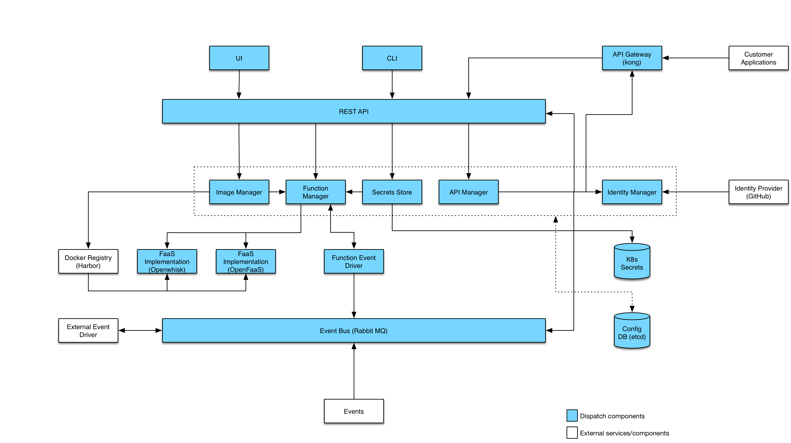

# VMware Dispatch

VMware Dispatch is a framework for deploying and managing serverless style applications.  The intent is a framework
which enables developers to build applications which are defined by functions which handle business logic and services
which provide all other functionality:

* State (Databases)
* Messaging/Eventing (Queues)
* Ingress (Api-Gateways)
* Etc.

Our goal is to provide a substrate which can be built upon and extended to serve as a framework for serverless
applications.  Additionally, the framework must provide tools and features which aid the developer in building,
debugging and maintaining their serverless application.

## Architecture

The diagram below illustrates the different components which make up the Dispatch project:



## Quickstart

Assumptions:

* Minikube is installed.  If not, simply download and install minikube
  (See [minikube](#minikube)).
* Kubectl installed and configured for minikube.
* Running on MacOS

```
# Start minikube (if not already started)
$ minikube start --vm-driver=hyperkit --bootstrapper=kubeadm --disk-size=50g --memory=6144 --kubernetes-version=v1.8.1
# Install and initialize helm (if not already installed)
$ brew install kubernetes-helm
$ helm init
```

Add the minikube IP to /etc/hosts:
```
$ sudo sh -c 'echo "$(minikube ip) dev.dispatch.vmware.com api.dev.dispatch.vmware.com" >> /etc/hosts'
```

Get the dispatch command:
```
$ curl -OL https://github.com/vmware/dispatch/releases/download/v0.1.1/dispatch-darwin
$ chmod +x dispatch-darwin
```

Configure an OAuth2 Client App at GitHub with instruction [How to Create OAuth Client
App](docs/create-oauth-client-app.md)

You should have ``<oauth-client-id>``, ``<oauth-client-secret>`` and ``<oauth-cookie-secret>`` now.

Configure the installation.  Substitute in your docker credentials (host and username are likely the same):
```
$ cat << EOF > config.yaml
namespace: dispatch
hostname: dev.dispatch.vmware.com
certificateDirectory: /tmp
chart:
  image:
    host: vmware
    tag: v0.1.1
repository:
  host: <docker repo>
  username: <docker username>
  email: <docker email>
  password: <docker password>
oauth2Proxy:
  clientID: <oauth2-client-id>
  clientSecret: <oauth2-client-secret>
  cookieSecret: <oauth2-cookie-secret>
EOF
```

Run Install:
```
$ ./dispatch-darwin install --file config.yaml --service all --debug
...
Config file written to: $HOME/.dispatch/config.json
```
Your dispatch config file $HOME/.dispatch/config.json will be generated
and have the following:-
```
cat $HOME/.dispatch/config.json
{
    "host": "dev.dispatch.vmware.com",
    "port": <port>,
    "organization": "",
    "cookie": "",
    "skipauth": false,
    "Json": false
}
```
Make a note of the `<port>` as this will be used in the next step.

Update the Callback URL of your OAuth2 Client App:

Dispatch runs on a non-standard https port on minikube since it uses
NodePort for the ingress controller service. Hence, update the
Authorization callback URL of your OAuth2 Client App (created by following
[How to Create OAuth Client App](docs/create-oauth-client-app.md)) from
`https://dev.dispatch.vmware.com/oauth2` to `https://dev.dispatch.vmware.com:<port>/oauth2`
where `<port>` can be found in your dispatch config file available at
$HOME/.dispatch/config.json.

Login (you will be directed to github for authorization):
```
$ ./dispatch-darwin login
You have successfully logged in, cookie saved to /Users/bjung/.dispatch/config.json
```

At this point, the environment is up and working.  Let's seed the service
with some images and functions.  In order to get the examples, you will need
to clone the repository (if you haven't already):
```
$ cd examples/
$ ./dispatch-darwin create --file seed.yaml
$ ./dispatch-darwin get images
   NAME   |                    URL                           |  BASEIMAGE   |   STATUS    |         CREATED DATE
------------------------------------------------------------------------------------------------------------------------
  nodejs6 | vmware/dispatch-openfaas-nodejs6-base:0.0.2-dev1 | nodejs6-base | READY       | Wed Dec  6 14:28:30 PST 2017
  python3 | vmware/dispatch-openfaas-python-base:0.0.4-dev1  | python3-base | INITIALIZED | Wed Dec  6 14:28:30 PST 2017
$ ./dispatch-darwin get functions
    NAME   |  IMAGE  | STATUS |         CREATED DATE
------------------------------------------------------------
  hello-js | nodejs6 | READY  | Wed Dec  6 14:29:05 PST 2017
  hello-py | python3 | READY  | Wed Dec  6 14:28:52 PST 2017
```

Execute a function:
```
$ ./dispatch-darwin exec hello-py --input '{"name": "Jon", "place": "Winterfell"}' --wait
Function hello-py finished successfully.
{
    "myField": "Hello, Jon from Winterfell"
}
```

Add an API endpoint:
```
$ ./dispatch-darwin create api --https-only --method POST --path /hello post-hello hello-py
```

Find the port for the api-gateway service (we are using the NodePort service
type):

```
$ kubectl -n kong get service api-gateway-kongproxy
NAME                    CLUSTER-IP     EXTERNAL-IP   PORT(S)                      AGE
api-gateway-kongproxy   10.107.109.1   <nodes>       80:31788/TCP,443:32611/TCP   19m
```

We are looking at the port associated with https/443 => 32611

```
$ curl -k "https://api.dev.dispatch.vmware.com:32611/hello" -H "Content-Type: application/json" -d '{"name": "Jon", "place": "winterfell"}'
{"myField":"Hello, Jon from winterfell"}
```

Want to add the UI:

```
helm install dispatch/ui --namespace dispatch --name ui --debug
```

Now open up a browser to: `https://dev.dispatch.vmware.com/ui/`

Now go build something!

## Prerequisites

Dispatch depends on Kubernetes as its deployment infrastructure.  Any
"standard" kubernetes should be supported.  Development is largely done on
minikube as it allows for easy local deployment.  This guide will focus on
two deployment models, minikube and vanilla hosted kubernetes 1.7+.

### Kubernetes

A kubernetes 1.7+ cluster is required for installing the Dispatch project

#### Minikube

Installing minikube is easy.  The following installs the latest minikube on a
mac.  See the official [minikube
repository](https://github.com/kubernetes/minikube) for more details:

```
$ brew cask install minikube
==> Satisfying dependencies
All Formula dependencies satisfied.
==> Downloading https://storage.googleapis.com/minikube/releases/v0.24.1/minikube-darwin-amd64
######################################################################## 100.0%
==> Verifying checksum for Cask minikube
==> Installing Cask minikube
==> Linking Binary 'minikube-darwin-amd64' to '/usr/local/bin/minikube'.
🍺  minikube was successfully installed!
```

Install the VM driver of your choice.  We recommend hyperkit:

```
$ curl -LO https://storage.googleapis.com/minikube/releases/latest/docker-machine-driver-hyperkit && chmod +x docker-machine-driver-hyperkit && sudo mv docker-machine-driver-hyperkit /usr/local/bin/ && sudo chown root:wheel /usr/local/bin/docker-machine-driver-hyperkit && sudo chmod u+s /usr/local/bin/docker-machine-driver-hyperkit
```

Create a kubernetes cluster:

```
$ minikube start --vm-driver=hyperkit --bootstrapper=kubeadm --disk-size=50g --memory=4096 --kubernetes-version=v1.8.1
Starting local Kubernetes v1.8.0 cluster...
Starting VM...
Downloading Minikube ISO
 140.01 MB / 140.01 MB [============================================] 100.00% 0s
Getting VM IP address...
Moving files into cluster...
Downloading kubeadm v1.8.0
Downloading kubelet v1.8.0
Finished Downloading kubelet v1.8.0
Finished Downloading kubeadm v1.8.0
Setting up certs...
Connecting to cluster...
Setting up kubeconfig...
Starting cluster components...
Kubectl is now configured to use the cluster.
Loading cached images from config file.
```

Verify installation:

```
$ kubectl get pods --all-namespaces
NAMESPACE     NAME                          READY     STATUS    RESTARTS   AGE
kube-system   kube-addon-manager-minikube   1/1       Running   0          54s
kube-system   kube-dns-545bc4bfd4-mjljc     3/3       Running   0          43s
kube-system   kube-proxy-nmzhd              1/1       Running   0          43s
kube-system   kubernetes-dashboard-5fllx    1/1       Running   2          41s
kube-system   storage-provisioner           1/1       Running   0          42s
```

#### Hosted Kubernetes

There are a variety of methods for installing kubernetes in a hosted environment (including a private datacenter).  This
is beyond the scope of this guide.  However, the dispatch charts depend on RBAC being enabled on the cluster. Check the
documentation of your Kubernetes deployer on how to enable RBAC authorization.

### Helm

[Helm](https://helm.sh) is the package manager for Kubernetes. Dispatch as well as many dependencies are installed and
managed via helm charts. Before anything can be installed, helm must be setup.

#### RBAC and Helm

Recent versions of Kubernetes have introduced roles and service accounts. Depending on how your Kubernetes cluster is
configured, one or more of the following may be required:

##### Add the cluster-admin clusterrole (required for Kubernetes on OpenStack - VIOK):

```
$ kubectl create clusterrole cluster-admin --verb=get,list,watch,create,delete,update,patch --resource=deployments,services,secrets
$ kubectl create clusterrolebinding tiller-cluster-admin --clusterrole=cluster-admin --serviceaccount=kube-system:default
```

> **Note:** some kubernetes deployments come with ``cluster-admin`` already, if so, you could skip the ``kubectl create
> clusterrole`` command

##### Add the tiller service account (required for clusters created via Kops - AWS):

```
kubectl -n kube-system create serviceaccount tiller
kubectl create clusterrolebinding tiller --clusterrole cluster-admin --serviceaccount=kube-system:tiller
helm init --service-account tiller
```

> **Note:** Although required for clusters created with Kops, creating a specific service account for tiller should be
> OK, and even encouraged, for all deployments.

#### Download Helm and install tiller:

```
$ brew install kubernetes-helm
# If not using the tiller service account, simply run `helm init`
$ helm init --service-account tiller
$HELM_HOME has been configured at /Users/bjung/.helm.

Tiller (the Helm server-side component) has been installed into your Kubernetes Cluster.
Happy Helming!
```

### Set a Few Environment Variables

Define the following environment variables.  The actual values can be whatever
you like:

```
export DISPATCH_HOST=dev.dispatch.vmware.com
export DISPATCH_NAMESPACE=dispatch
export DISPATCH_OAUTH_CLIENT_ID = <oauth-client-id>
export DISPATCH_OAUTH_CLIENT_SECRET = <oauth-client-secret>
export DISPATCH_OAUTH_COOKIE_SECRET = <oauth-cookie-secret>

# In the case of dockerhub, just use your docker username (i.e.
# DOCKER_REGISTRY=berndtj)
export DOCKER_REGISTRY=vmware/dispatch
```

Please see [How to Create OAuth Client App](docs/create-oauth-client-app.md) to learn to how to generate
``<oauth-client-id>``, ``<oauth-client-secret>`` and ``<oauth-cookie-secret>`` (note: currently GitHub is the only
supported provider)

### Configure Image Registry

Dispatch pulls and pushes images as part of the image manager component.  In order to do so, image registry credentials
must be [configured](https://kubernetes.io/docs/tasks/configure-pod-container/pull-image-private-registry/):

```
$ kubectl create secret docker-registry regsecret --docker-server=<your-registry-server> --docker-username=<your-name> --docker-password=<your-pword> --docker-email=<your-email>
```

Docker hub example:

```
$ kubectl create secret docker-registry regsecret --docker-server='https://index.docker.io/v1/' --docker-username=dockerhub-user --docker-password='...' --docker-email=dockerhub-user@gmail.com
```

### Import self-signed TLS certificates into Kubernetes secret

To be able to securely connect to Dispatch, we need to set up a TLS certificate.

```
$ ./scripts/make-ssl-crt.sh $DISPATCH_NAMESPACE $DISPATCH_HOST
```

With the above command, we create a self-signed certificates named ``dispatch-tls``, and ``api-dispatch-tls``, and then
import it into kubernetes secret store.

Note this is only required ONCE per a kubernetes cluster.


### Install Ingress Controller

A nginx ingress controller is required for Dispatch, please install it with (this will be installed into the kube-system
namespace).

For minikube:
```
$ helm install ./charts/nginx-ingress --namespace=kube-system --name=ingress --set=controller.service.type=NodePort --wait
```

For hosted kubernetes:
```
$ helm install ./charts/nginx-ingress --namespace=kube-system --name=ingress --wait
```

Get IP address to ingress controller by:

For minikube:
```
$ minikube ip
```

For hosted kubernetes:
```
$ kubectl describe service ingress-nginx-ingress-controller --namespace=kube-system
```
You should find the public IP from the ``LoadBalancer`` section,

Edit `etc/hosts` and add/edit a record for this Dispatch deployment:

```
$ cat /etc/hosts
##
# Host Database
#
# localhost is used to configure the loopback interface
# when the system is booting.  Do not change this entry.
##
127.0.0.1	localhost
255.255.255.255	broadcasthost
::1             localhost
192.168.64.7	dev.dispatch.vmware.com
```

### Install FaaS (openFaaS)

The framework is architected to support multiple FaaS implementations. Presently
[OpenFaaS](https://github.com/openfaas/faas) is the preferred FaaS:

```
$ helm install --namespace=openfaas --name=openfaas --set=exposeServices=false ./charts/openfaas --wait
```

### Install Api-gateway (Kong)

For minikube:
```
helm install --namespace=kong --name=api-gateway --set services.proxyService.type=NodePort ./charts/kong --wait
```

For hosted kubernetes:
```
helm install --namespace=kong --name=api-gateway ./charts/kong --wait
```

## Building and Deploying Dispatch

Now that all of the setup is done, the only thing left is to build and deploy. Ideally, as long as the cluster is up,
you are done with setup.

### Building Images

By default, Images are pushed to the `vmware` repository. If you prefer to use different registry, ensure the
`DOCKER_REGISTRY` environment variable is set:

```
$ echo $DOCKER_REGISTRY
dockerhub-user
```

In order to push images, the docker client must be logged into the registry:

```
docker login $DOCKER_REGISTRY
```

> **NOTE:** if using docker hub, do not include the registry as an argument (i.e. `docker login`)

Once logged in, you can now build (and push) the images:

```
make images
```

The result should be 7 images:

```
$ docker images | grep $(cat values.yaml | grep tag | cut -d ':' -f 2)
berndtj/dispatch-event-driver                                                                dev-1511831075      285ebca2a1a2        24 minutes ago      106MB
berndtj/dispatch-event-manager                                                               dev-1511831075      537108e4fe2b        24 minutes ago      61.2MB
berndtj/dispatch-api-manager                                                                 dev-1511831075      c735cc5539fe        24 minutes ago      58.8MB
berndtj/dispatch-secret-store                                                                dev-1511831075      71c284321f6b        25 minutes ago      124MB
berndtj/dispatch-function-manager                                                            dev-1511831075      ef55b922b661        25 minutes ago      65.7MB
berndtj/dispatch-identity-manager                                                            dev-1511831075      cb045ec07d14        25 minutes ago      60.1MB
berndtj/dispatch-image-manager                                                               dev-1511831075      4efd00b0318f        25 minutes ago      61.4MB
```

### Installing the Dispatch Chart

First create an docker authorization token for openfaas:
```
export OPENFAAS_AUTH=$(echo '{"username":"bjung","password":"********","email":"bjung@vmware.com"}' | base64)
```

The first time the chart is installed, chart dependencies must be fetched:

```
cd ./charts/dispatch
helm dep up
cd -
```

A values.yaml was created as an artifact of `make images`.
```
$ helm install ./charts/dispatch --name=dev-dispatch --namespace dispatch \
  -f values.yaml \
  --set function-manager.faas.openfaas.registryAuth=$OPENFAAS_AUTH \
  --set function-manager.faas.openfaas.imageRegistry=$DOCKER_REGISTRY \
  --set global.host=$DISPATCH_HOST \
  --set global.image.host=$DOCKER_REGISTRY \
  --set oauth2-proxy.app.clientID=$DISPATCH_OAUTH_CLIENT_ID  \
  --set oauth2-proxy.app.clientSecret=$DISPATCH_OAUTH_CLIENT_SECRET \
  --set oauth2-proxy.app.cookieSecret=$DISPATCH_OAUTH_COOKIE_SECRET \
  --debug
```

You can monitor the deployment with kubectl:
```
$ kubectl -n dispatch get deployment
NAME                              DESIRED   CURRENT   UP-TO-DATE   AVAILABLE   AGE
dev-dispatch-api-manager        1         1         1            1           1h
dev-dispatch-echo-server        1         1         1            1           1h
dev-dispatch-event-manager      1         1         1            1           1h
dev-dispatch-function-manager   1         1         1            1           1h
dev-dispatch-identity-manager   1         1         1            1           1h
dev-dispatch-image-manager      1         1         1            1           1h
dev-dispatch-oauth2-proxy       1         1         1            1           1h
dev-dispatch-rabbitmq           1         1         1            1           1h
dev-dispatch-secret-store       1         1         1            1           1h
$ kubectl -n dispatch get service
NAME                              CLUSTER-IP   EXTERNAL-IP   PORT(S)                                 AGE
dev-dispatch-api-manager        10.0.0.179   <none>        80/TCP                                  1h
dev-dispatch-echo-server        10.0.0.58    <none>        80/TCP                                  1h
dev-dispatch-event-manager      10.0.0.13    <none>        80/TCP                                  1h
dev-dispatch-function-manager   10.0.0.145   <none>        80/TCP                                  1h
dev-dispatch-identity-manager   10.0.0.245   <none>        80/TCP                                  1h
dev-dispatch-image-manager      10.0.0.188   <none>        80/TCP                                  1h
dev-dispatch-oauth2-proxy       10.0.0.51    <none>        80/TCP,443/TCP                          1h
dev-dispatch-rabbitmq           10.0.0.180   <none>        4369/TCP,5672/TCP,25672/TCP,15672/TCP   1h
dev-dispatch-secret-store       10.0.0.249   <none>        80/TCP                                  1h
```

### Test your Deployment

#### Test with ``curl``

Check that the ingress controller is routing to the identity manager
```
$ curl -k https://dev.dispatch.vmware.com/oauth2/start
<a href="https://github.com/login/oauth/authorize?approval_prompt=force&amp;client_id=8e3894cb0199f8342f0a&amp;redirect_uri=https%3A%2F%2Fdev.dispatch.vmware.com%2Foauth2%2Fcallback&amp;response_type=code&amp;scope=openid%2C+user%3Aemail&amp;state=13939a602fb6704121766b0f5ba588cb%3A%2F">Found</a>.
```

#### Test with ``dispatch`` CLI

If you haven't already, build the `dispatch` CLI:

```
make cli-darwin
ln -s `pwd`/bin/dispatch-darwin /usr/local/bin/dispatch
```

In order to use the `dispatch` CLI, set `$HOME/.dispatch.yaml` to point to the new services:

```
$ cat << EOF > ~/.dispatch.yaml
host: $DISPATCH_HOST
port: 443
organization: vmware
cookie: ""
EOF
```

At this point the `dispatch` CLI should work:

```
$ dispatch login
You have successfully logged in, cookie saved to /Users/bjung/.dispatch.yaml
$ dispatch get image
Using config file: /Users/bjung/.dispatch.yaml
  NAME | URL | BASEIMAGE | STATUS | CREATED DATE
```
