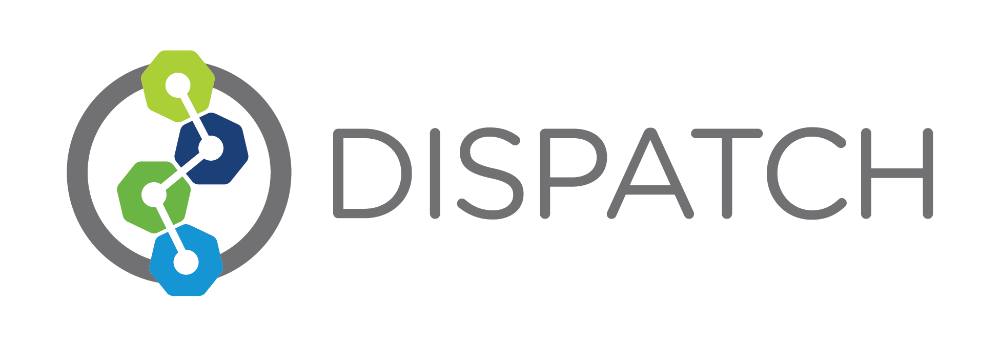
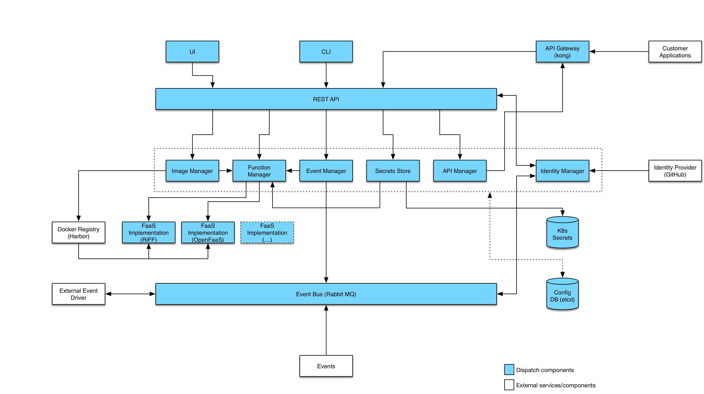

Dispatch is a framework for deploying and managing serverless style applications.  The intent is a framework
which enables developers to build applications which are defined by functions which handle business logic and services
which provide all other functionality:

* State (Databases)
* Messaging/Eventing (Queues)
* Ingress (Api-Gateways)
* Etc.

Our goal is to provide a substrate which can be built upon and extended to serve as a framework for serverless
applications.  Additionally, the framework must provide tools and features which aid the developer in building,
debugging and maintaining their serverless application.

## Documentation

Checkout the detailed [documentation](https://vmware.github.io/dispatch) including a [quickstart guide](https://vmware.github.io/dispatch/documentation/guides/quickstart).

## Architecture

The diagram below illustrates the different components which make up the Dispatch project:



## Installation

Installing Dispatch is easy once you have a compatible Kubernetes installation.  For instance, to deploy on minikube:

1. Fetch the IP address of minikube as this will be used the host for dispatch services.
```
export DISPATCH_HOST=$(minikube ip)
```

2. Configure the installation:
```
$ cat << EOF > config.yaml
apiGateway:
  host: $DISPATCH_HOST
dispatch:
  host: $DISPATCH_HOST
  debug: true
  skipAuth: true
EOF
```

3. Install Dispatch:
```
$ dispatch install --file config.yaml
```

For a more complete quickstart see the [developer documentation](#documentation)

## Contributing

You are invited to contribute new features, fixes, or updates, large or small; we are always thrilled to receive pull
requests, and do our best to process them as fast as we can. If you wish to contribute code and you have not signed our
contributor license agreement (CLA), our bot will update the issue when you open a [Pull
Request](https://help.github.com/articles/creating-a-pull-request). For any questions about the CLA process, please
refer to our [FAQ](https://cla.vmware.com/faq).

Before you start to code, we recommend discussing your plans through a  [GitHub
issue](https://github.com/vmware/dispatch/issues) or discuss it first with the official project
[maintainers](AUTHORS.md) via the [#Dispatch Slack Channel](https://vmwarecode.slack.com/messages/dispatch/), especially
for more ambitious contributions. This gives other contributors a chance to point you in the right direction, give you
feedback on your design, and help you find out if someone else is working on the same thing.

## License

Admiral is available under the [Apache 2 license](LICENSE).