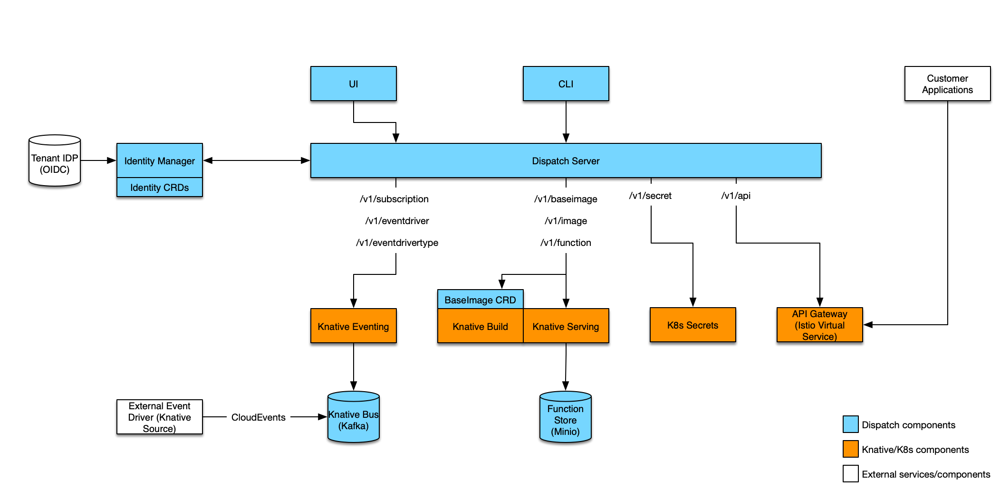

> **NOTE:** This is the knative branch of Dispatch.  Full dispatch functionality is still a ways off.  The code here
> represents a work in progress.  Links to documentation are likely outdated.

Dispatch is a framework for deploying and managing serverless style applications.  The intent is a framework
which enables developers to build applications which are defined by functions which handle business logic and services
which provide all other functionality:

* State (Databases)
* Messaging/Eventing (Queues)
* Ingress (Api-Gateways)
* Etc.

Our goal is to provide a substrate which can be built upon and extended to serve as a framework for serverless
applications.  Additionally, the framework must provide tools and features which aid the developer in building,
debugging and maintaining their serverless application.

## Documentation

> **NOTE**: The links below refer to an old verion of dispatch and may not be accurrate.

Checkout the detailed [documentation](https://vmware.github.io/dispatch) including a [quickstart guide](https://vmware.github.io/dispatch/documentation/guides/quickstart).

## Architecture

The diagram below illustrates the different components which make up the Dispatch project:



## Installation

### Prerequisites

#### GKE

1. [Create service account key](https://cloud.google.com/iam/docs/creating-managing-service-account-keys#iam-service-account-keys-create-console)
    ```bash
    export GCLOUD_KEY=<path to key.json>
    ```

2. Create GKE cluster:
    ```bash
    export K8S_VERSION=1.10.7-gke.6
    export CLUSTER_NAME=dispatch-knative
    gcloud container clusters create -m n1-standard-4 --cluster-version ${K8S_VERSION} ${CLUSTER_NAME} --zone us-west1-c
    gcloud container clusters get-credentials ${CLUSTER_NAME} --zone us-west1-c
    ```

3. Install Knative:
    ```bash
    # Get the current knative verision used with dispatch
    KNATIVE_VERSION=$(cat Gopkg.toml | grep -A 2 'name = "github.com/knative/serving"' | grep revision | cut -d '"' -f2)
    ./scripts/install-knative.py ${CLUSTER_NAME} --gcloud-key=${GCLOUD_KEY} --revision=${KNATIVE_VERSION}
    ```

#### Other

In order to install Knative, follow the [development instructions](https://github.com/knative/serving/blob/master/DEVELOPMENT.md)

## Dispatch

Installing Dispatch depends on having a Kubernetes cluster with the Knative components installed (Build, Serving and soon Eventing).  From here build and install dispatch as follows:

1. Set the following environment variables:
    ```bash
    export DISPATCH_NAMESPACE="dispatch-server"
    export DISPATCH_DEBUG="true"
    export RELEASE_NAME="dispatch-server"
    export MINIO_USERNAME="dispatch"
    export MINIO_PASSWORD="dispatch"
    export DOCKER_REPOSITORY="{dockerhub_username}"
    export INGRESS_IP=$(kubectl get service -n istio-system knative-ingressgateway -o json | jq -r ".status.loadBalancer.ingress[0].ip")
    ```
    > Note: You may need to modify `DISPATCH_SERVER_DOCKER_REPOSITORY` in `scripts/images.sh` to your dockerhub username
2. Build and publish a dispatch image:
    ```bash
    PUSH_IMAGES=1 make images
    ```
    > **NOTE**: You may need `docker login` before push

3. The previous command will output a configuration file `values.yaml`:
    ```yaml
    image:
      host: username
      tag: v0.1.xx
    storage:
      minio:
        username: ********
        password: ********
    ```

4. Deploy via helm chart (if helm is not installed and initialized, do that first):
    ```bash
    cd charts/dispatch
    helm dependency update
    helm init
    cd ../..
    helm upgrade -i --debug ${RELEASE_NAME} ./charts/dispatch --namespace ${DISPATCH_NAMESPACE} -f values.yaml
    ```
    > **NOTE**: Use following to create cluster role binding for tiller:
    >```bash
    >kubectl create clusterrolebinding tiller-cluster-admin --clusterrole=cluster-admin --serviceaccount=kube-system:default
    >```

5. Reconfigure Knative serving (need to whitelist our internal repository):
    ```bash
    ./scripts/configure-knative.sh
    ```

6. Build the CLI (substitute darwin for linux if needed):
    ```bash
    make cli-darwin
    # Create symlink to binary
    ln -s `pwd`/bin/dispatch-darwin /usr/local/bin/dispatch
    ```

7. Create the Dispatch config:
    ```bash
    cat << EOF > config.json
    {
      "current": "${RELEASE_NAME}",
      "contexts": {
        "${RELEASE_NAME}": {
          "host": "$(kubectl -n ${DISPATCH_NAMESPACE} get service ${RELEASE_NAME}-nginx-ingress-controller -o json | jq -r ".status.loadBalancer.ingress[].ip")",
          "port": 443,
          "scheme": "https",
          "insecure": true
        }
      }
    }
    EOF
    # point to the config file (could also move to ~/.dispatch/config)
    export DISPATCH_CONFIG=`pwd`/config.json
    ```

8. Test out your install:
    First, create an baseimage:
    ```bash
    dispatch create base-image python3-base dispatchframework/python3-base:0.0.13-knative
    Created baseimage: python3-base
    ```
    Then, create an image:
    ```bash
    dispatch create image python3 python3-base
    Created image: python3
    ```
    Wait for status READY:
    ```bash
    dispatch get images
       NAME  | DESTINATION | BASEIMAGE | STATUS |         CREATED DATE
    --------------------------------------------------------------------------
     python3 | *********** | ********* | READY  | Tue Sep 25 16:51:35 PDT 2018
    ```
    Create a function:
    ```bash
    dispatch create function --image python3 hello ./examples/python3/hello.py
    Created function: hello
    ```
    Once status is READY:
    ```bash
    dispatch get function
       NAME  | FUNCTIONIMAGE | STATUS |         CREATED DATE
    ----------------------------------------------------------------
      hello  | ************* | READY  | Thu Sep 13 12:41:07 PDT 2018
    ```
    Exec the function:
    ```bash
    dispatch exec hello <<< '{"name": "user"}' | jq .
    {
      "context": {
        "logs": {
          "stdout": [
            "messages to stdout show up in logs"
          ],
          "stderr": null
        }
      },
      "payload": {
        "myField": "Hello, user from Nowhere"
      }
    }
    ```
    Create an endpoint:
    ```bash
    dispatch create endpoint get-hello hello --method GET --method POST --path /hello
    ```
    Hit the endpoint with curl:
    ```bash
    curl -v http://${INGRESS_IP}/hello?name=Jon -H 'Host: default.dispatch-server.dispatch.local'
    ```

9. Delete dispatch server
    ```bash
    helm delete dispatch-server
    ```
For a more complete quickstart see the [developer documentation](#documentation)
