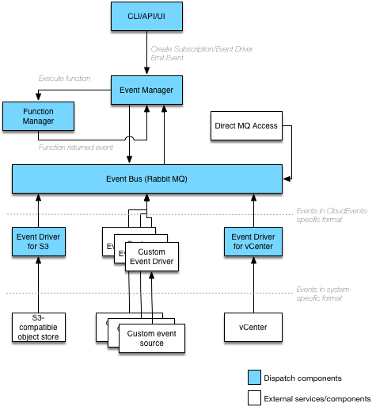

# Event manager

Event manager handles events traffic within Dispatch. It connects events to functions using subscriptions,
as well as allows creating event drivers, which serve as event sources.

## Problem statement

Functions are commonly associated with events and are executed in response to them. To effectively manage their
relation, we need a way to handle events lifecycle (CRUD) as well as subscriptions and triggering.

### User stories (examples)

1. As a **developer**, I want to trigger an **event** by providing its **name/topic** and JSON-formatted **payload**, which will
   in turn cause execution of one or more functions **subscribed** to that event.
2. As a **developer**, I want to create a **subscription** between **event** and **function**. When event is triggered,
   function(s) is/are executed with event payload.
3. As a **developer/administrator**, I want to provide sustainable way of ingesting events

## Proposed Solution

An Event Manager component, responsible for event and subscription lifecycle.

Event manager:
* Exposes API for CRUD operations on subscriptions.
* Exposes API for CRUD operations on event drivers and heir types.
* Exposes API to trigger events.
* Executes functions subscribed to particular events.

## Design



### Subscription object schema
* `subscriptionName` - `string` - subscription Name.
* `eventType` - `string` - event Type to subscribe to.
* `sourceType` - `string` - source type to filter on.
* `functionName` - `string` - name of the function to execute when matching event is received.
### Event object schema

Event object schema follows the [CloudEvent spec](https://github.com/cloudevents/spec/blob/b0124528486d3f6b9a247cadd68d91b44b3d3ef4/spec.md) 

```go
package events

type CloudEvent struct {
	// Event context
	// Mandatory, e.g. "com.vmware.vsphere"
	Namespace string `json:"namespace" validate:"required"`
	// Mandatory, e.g. "user.created"
	EventType string `json:"event-type" validate:"required,max=128,eventtype"`
	// Optional, e.g. "VMODL6.5"
	EventTypeVersion string `json:"event-type-version,omitempty" validate:"omitempty,min=1"`
	// Mandatory, fixed to "0.1"
	CloudEventsVersion string `json:"cloud-events-version" validate:"eq=0.1"`
	// Mandatory, e.g. "vcenter"
	SourceType string `json:"source-type" validate:"required,max=32"`
	// Mandatory, e.g. "vcenter1.corp.local"
	SourceID string `json:"source-id" validate:"required,max=64"`
	// Mandatory, e.g. UUID or "43252363". Must be unique for this Source
	EventID string `json:"event-id" validate:"required"`
	// Optional, Timestamp in RFC 3339 format, e.g. "1985-04-12T23:20:50.52Z"
	EventTime time.Time `json:"event-time,omitempty" validate:"-"`
	// Optional, if specified must be a valid URI
	SchemaURL string `json:"schema-url,omitempty" validate:"omitempty,uri"`
	// Optional, if specified must be a valid mime type, e.g. "application/json"
	ContentType string `json:"content-type,omitempty" validate:"omitempty,min=1"`
	// Optional, key-value dictionary for use by Dispatch
	Extensions CloudEventExtensions `json:"extensions,omitempty" validate:"omitempty,min=1"`

	// Event payload
	Data string `json:"data",validate:"omitempty"`
}

// CloudEventExtensions holds attributes for CloudEvent that are not part of the standard.
type CloudEventExtensions map[string]interface{}

```
## Milestones

TBD

