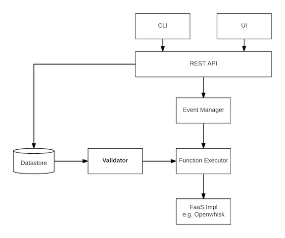

# Function Input/Output Data Schemas


## Current Issues
  
Incoming event data is mostly expected to have a certain structure that can be formally checked before handing the data to a serverless function (which currently is not done).

Function developer has to put input data validation code in every function, which is
  - repetitive,
  - additional potential source of bugs.

The same applies to function return values (objects).


## Proposed Solution

Data validation service integrated with VMware Serverless.
  - Should be built-in into the platform for performance reasons.
  - Implemented as a middleware wrapping around serverless function calls.

Additionally, based on the function input/output schemas, we could generate function stubs, that would be able to receive (and validate) events and emit conforming (but random) payloads. 


## Requirements
  
  - Data validation is optional
  - Configurable using the CLI
  - Schemas themselves are checked for correctness when registered
  - Schema sources are in YAML or JSON files (alongside the validated functions' source files)


## Design

The parts of the platform dealing with schemas and validation are: CLI, API, function execution runtime, data store.




### Schemas and Namespaces

Schemas, along with functions, are grouped using namespaces, e.g. `/elastic-sky.pizza/entities.yaml`


### CLI

#### CRUD schemas

`create`, `get`, `update`, `delete`. E.g. create schema:

```bash
vs schema create \
    --source ./order-in.yaml \
    /elastic-sky.pizza/schemas/order-in
```

#### Use schemas

Specify function input and/or output schemas:
```bash
vs function create \
    --input-schema /elastic-sky.pizza/schemas/order-in \
    --output-schema /elastic-sky.pizza/schemas/order-out \
    --source order.js
    /elastic-sky.pizza/order
```

Switch input and/or output validation on/off for a function:
```bash
vs function update \
    --input-schema-on \
    --output-schema-off \
    /elastic-sky.pizza/order
```

Validate a piece of data (convenience command to be used during function development/debugging):
```bash
vs schema validate /elastic-sky.pizza/schemas/order-in < ./data.json
```


### API

REST API endpoint (schema CRUD operations): `/schemas`


### Function Invocation Data Flow

When a function with input validation configured is invoked:

1. The invocation record has just been created. Record state `intercepted-before` for the invocation.

2. If input data schema is set and input validation is turned on, validate the input event data. 
  - If the data is not valid:
    1. Record state `input-invalid` for the invocation.
    2. Emit **data validation error** event with the details (what's invalid) and record reference to it in the _output event_ property of the invocation.
    3. Finish processing the invocation. 

3. Proceed with the invocation and deliver the input event data to the function.


When the function code has just successfully returned: 

1. The function produces output (by returning a value/object). 

2. Validate the output data. Normally, the data is valid and we just proceed.
  - If the data does not conform to schema:
    1. Record state `output-invalid` for the invocation.
    2. Emit **data validation error** event with the details (what's invalid) and record reference to it in the _output event_ property of the invocation.
    3. Finish processing the invocation.

### Persistence

Schemas are stored in the platform data store.


## Milestones

TBD


## Open Issues

TBD
